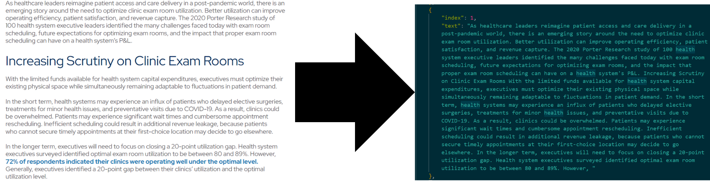

# A Prototype for Retrieval Augmented Generation with a Knowledge Base
This project uses a series of rudimentary tools to create a system that uses a "Knowledge Base" to give a Large Language Model (LLM) information to generate answers optimized for business use cases. This system meets accomplishes the following goals:
1. Extracting data from PDF's stored in a knowledge base
2. Inserting the indexed text data into a vector database
3. Querying that database
4. Using an LLM to provide a concise response

## Introduction
In the last two years, LLM's have exploded on to the business scene. They perform quite well when it comes to general applications like email writing, code completion, assistance with documentation, and supporting automated responses. But, what does a business do when they want a more specific application? 

For example, it would be useful to have an LLM use documentation created by your company to generate a response that uses facts and citations to adapt a response to a very specific situation. Think of it as an internal search function, sort of like what Gemini currently does in Google, but for your data. 


This fills in the gaps of an LLM, enriching it with specific technical data and allowing it to cite sources that are relevant to you.


## Prerequisites
- Have Docker installed on your machine
- Set up a local [marqo container](https://github.com/marqo-ai/marqo/blob/mainline/README.md)
- An API key for OpenAI (set up in your environment variables)

# Workflow
## Step 1. Convert files from database into readable data
Use the 'pdf_to_json' Jupyter Notebook to transform a PDF into useful text. This notebook steps you through the process of using the PyMuPDF package to extract text, convert that text into JSON format, then do some basic cleaning of the data.


## Step 2. Index the data in a vector database
Use the first half 'marqobook' Jupyter Notebook to set up a Client for the marqo backend hosted in docker and to use the marqo package's functions to vectorize the data and index it.


## Step 3. Set up search prompt and query with LLM
Use the second half of the 'marqobook' to give the queried data and the question to the LLM.
#### Question:
```
"What utilization gap do executives need to focus on?"
```
#### Answer:
```
Executives need to focus on closing a 20-point utilization gap, as identified by health system executives surveyed. 
This gap refers to the difference between the optimal exam room utilization of 80-89% and the current utilization rate. 
While it may be challenging, small improvements in utilization can result in significant cost savings, according to a health system that saw a $140,000 per year increase for every 1% improvement in utilization. 
Additionally, 70% of executives surveyed expressed interest in solutions that can help close this gap, as proper exam room management is crucial but can be difficult without purpose-built technology.
```
