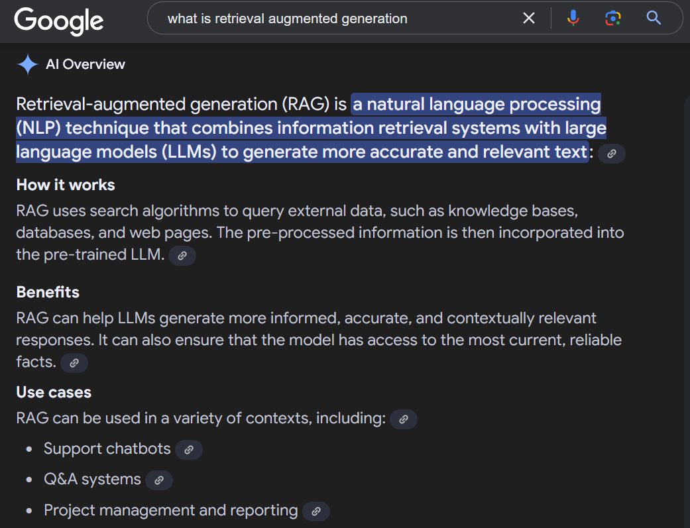
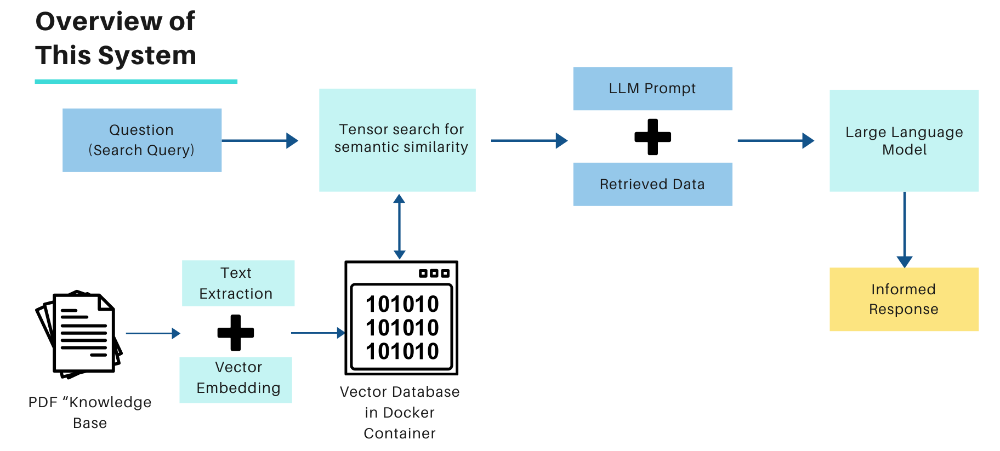

# A Prototype for Generative Search of a Knowledge Base
This project uses a series of rudimentary tools to create a system that uses a "Knowledge Base" to give a Large Language Model (LLM) information to generate answers optimized for business use cases. This system meets accomplishes the following goals:
    1. Extracting data from PDF's stored in a knowledge base
    2. Inserting the indexed text data into a vector database
    3. Querying that database
    4. Using an LLM to provide a concise response

## Introduction
In the last two years, LLM's have exploded on to the business scene. They perform quite well when it comes to general applications like email writing, code completion, assistance with documentation, and supporting automated responses. But, what does a business do when they want a more specific application? 

For example, it would be useful to have an LLM use documentation created by your company to generate a response that uses facts and citations to adapt a response to a very specific situation. Think of it as an internal search function, sort of like what Gemini currently does in Google, but for your data. 

This fills in the gaps of an LLM, enriching it with specific technical data and allowing it to cite sources that are relevant to you.

## Prerequisites
- Have Docker installed on your machine
- Set up a [marqo container](https://github.com/marqo-ai/marqo/blob/mainline/README.md)
- An API key for OpenAI (set up in your environment variables)

