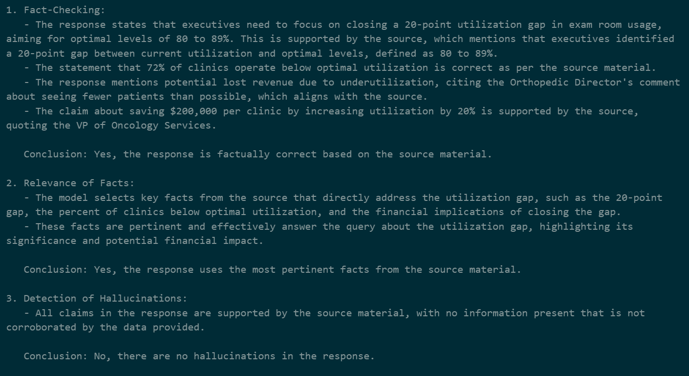

# A Prototype for Retrieval Augmented Generation with a Knowledge Base
This project uses a series of rudimentary tools to create a system that leverages a "Knowledge Base" to provide a Large Language Model (LLM) with information to generate answers optimized for business use cases. This system accomplishes the following goals:
1. Extracting data from PDF's stored in a knowledge base
2. Inserting the indexed text data into a vector database
3. Querying that database
4. Using an LLM to provide a concise response

## Introduction
In the last two years, LLM's have exploded on to the business scene. They perform quite well when it comes to general applications like email writing, code completion, assistance with documentation, and supporting automated responses. But, what does a business do when they want a more specific application? 

For example, it would be useful to have an LLM use documentation created by your company to generate a response that uses facts and citations to adapt a response to a very specific situation. Think of it as an internal search function, sort of like what Gemini currently does in Google, but for your data. 


This fills in the gaps of an LLM, enriching it with specific technical data and allowing it to cite sources that are relevant to you.


## Prerequisites
- Docker installed on your machine
- A local [marqo container](https://github.com/marqo-ai/marqo/blob/mainline/README.md) set up
- An API key for OpenAI (set up in your environment variables)

# Workflow
## Step 1. Convert files from database into readable data
Use the 'pdf_to_json' Jupyter Notebook to transform a PDF into useful text. This notebook steps you through the process of using the PyMuPDF package to extract text, convert that text into JSON format, then do some basic cleaning of the data.


## Step 2. Index the data in a vector database
Use the first half 'marqobook' Jupyter Notebook to set up a Client for the marqo backend hosted in docker, and to use the marqo package's functions to vectorize the data and index it.


## Step 3. Set up search prompt and query with LLM
Use the second half of the 'marqobook' to give the queried data and the question to the LLM.
#### Question:
```
"What utilization gap do executives need to focus on?"
```
#### Answer:
```
Executives need to focus on closing a 20-point utilization gap in exam room usage to align with optimal levels of 80 to 89%. 

- Health system executives indicated that their clinics are operating significantly below optimal utilization, with 72% reporting lower levels.
- The identified utilization gap averages 20 points from the optimal usage.
- Closing this gap could dramatically impact health system revenue; for instance, the Orthopedic Director noted potential lost revenue from being able to see more patients daily (35 to 40 instead of 25 to 30).
- Increasing exam room utilization by 20% could lead to savings of $200,000 per clinic, translating to $2.8 million in annual savings for systems with 14 clinics.
```

## Step 4. Evaluate model performance
Since the input and output will vary widely, we will use a [Model Grading](https://cookbook.openai.com/examples/evaluation/getting_started_with_openai_evals?utm_source=chatgpt.com) strategy to investigate performance. First, we will set up an eval prompt, then run a new model with the source data and the 'ans' variable from the previous step. 
This model will assess if the output matches the source material, thereby automating the process of checking for correctness. This can be used in a production pipeline to ensure that responses meet quality standards. In the future, this could also be a useful step in a test harness for comparing multiple model's performance.


